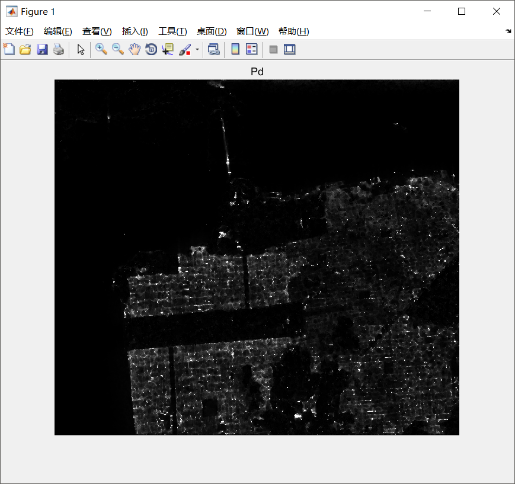
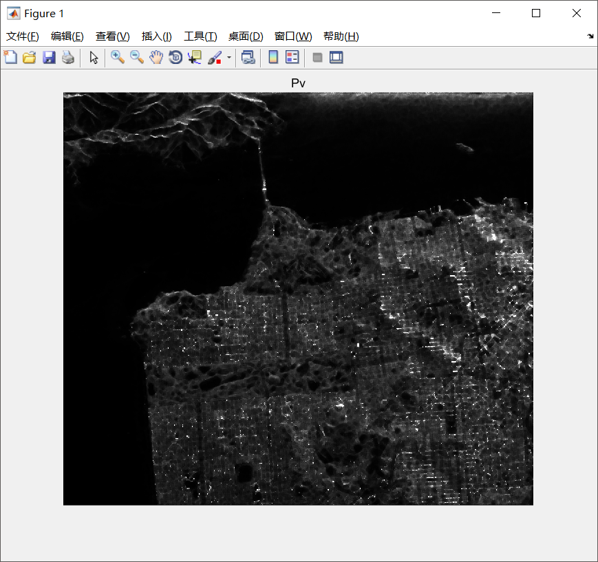

## Results
### Part 1
- The following figures are generated by ```Matlab 2018a```
<table>
   <tr>
       <td>
            
       </td>
       <td>
           
       </td>
   </tr>
    <tr>
       <td>
            
       </td>
       <td>
           
       </td>
   </tr>
</table>

### Part 2
- The following figures are generated by ```PolSARpro 1.0```, as a comparison of the part 1
<table>
   <tr>
       <td>
            
       </td>
       <td>
           
       </td>
   </tr>
    <tr>
       <td>
           
       </td>
       <td>
           
       </td>
   </tr>
</table>

