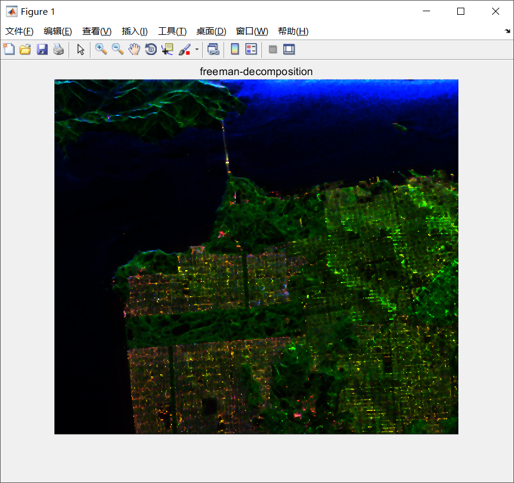
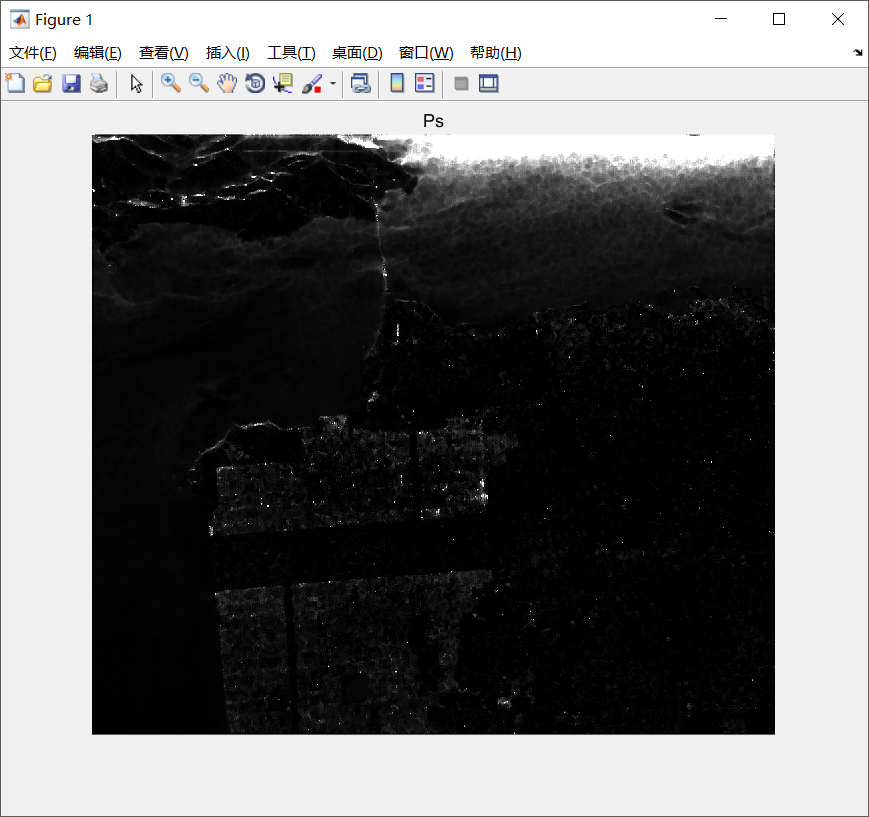
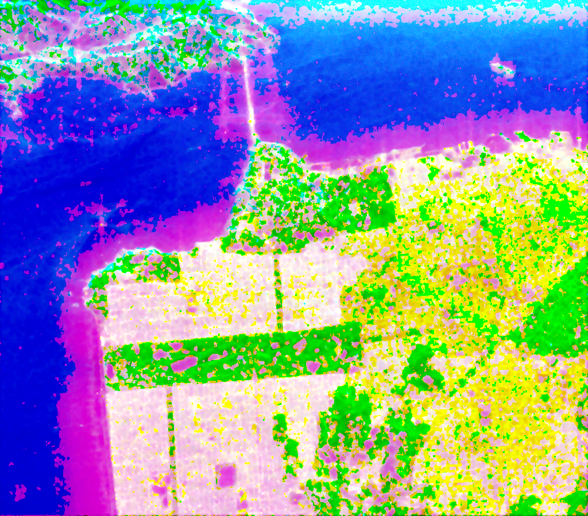
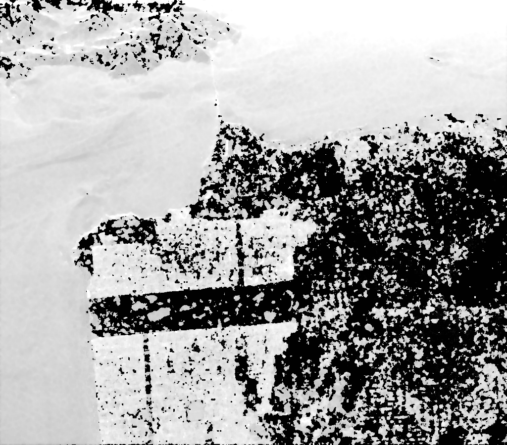
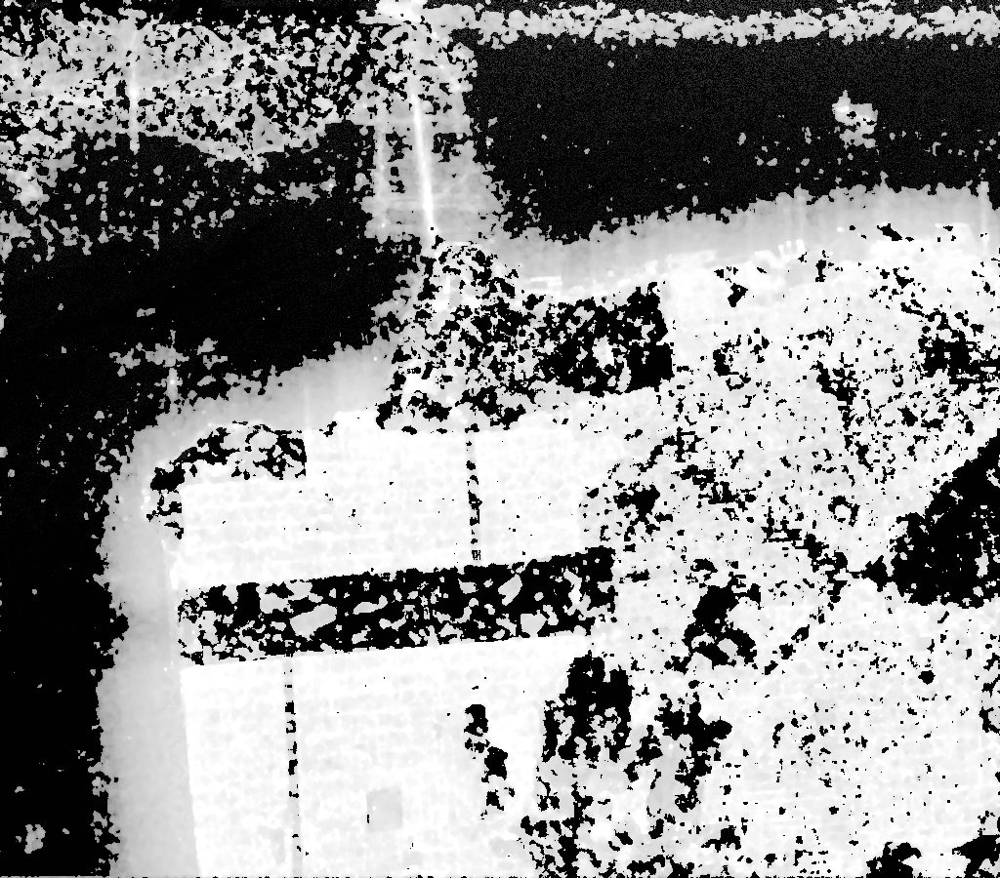
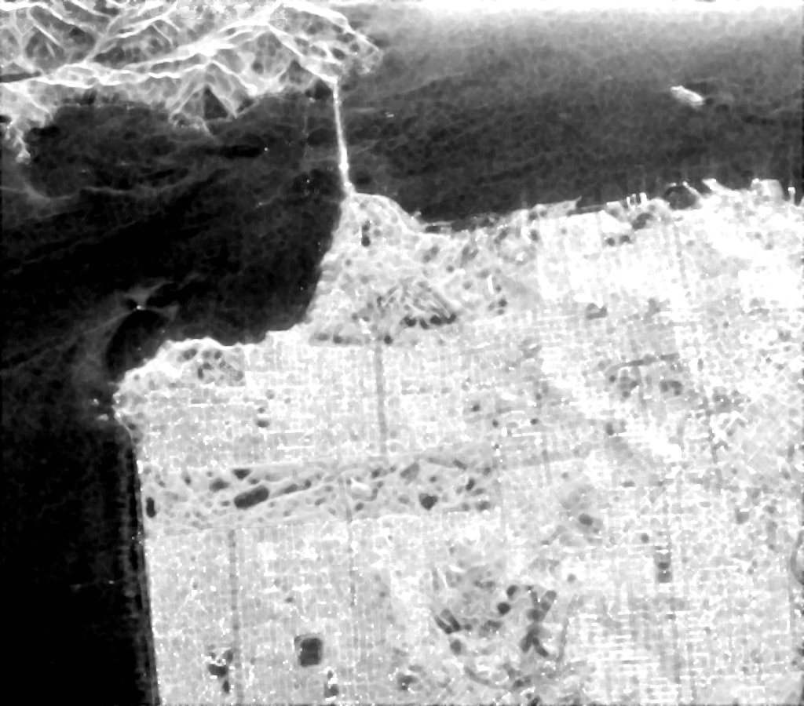

## Results
```
  The following figures are generated by MATLAB 
```
<center class="half">
    
    
</center>

```
  The following figures are generated by PolSARpro 
```
<center class="half">
    
    
</center>
